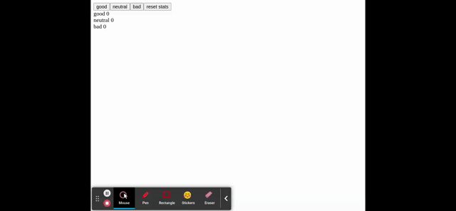

# Unicafe Redux

> Frontend for unicafe project using Redux.
> Assignment for course Fullstack open 2021.
> Written in ReactJs 

[Course link](https://fullstackopen.com/en/part6/)

## Demo



## Run

```bash
$> npm install
$> npm start
...
```
